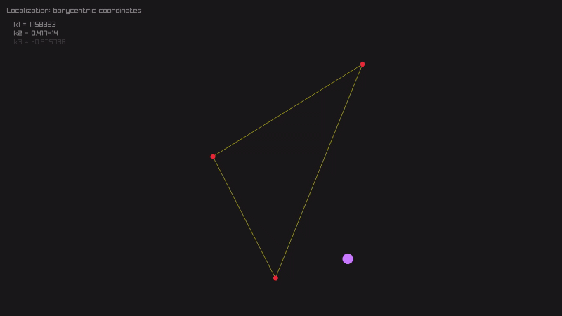

# Quick start

Don't forget to `git clone --recursive-submodules ...` or `git submodule update --init` to get raylib and raygui

Or you can modify Makefile to use already installed ones:
```Makefile
RAYLIB_PATH = ...
RAYGUI_PATH = ...

...
```

`RAYLIB_PATH` must contain raylib headers and libraylib.a

`RAYGUI_PATH` must contain `raygui.h`

Just run `make` to build everything

## Scene 1


## Scene 2


