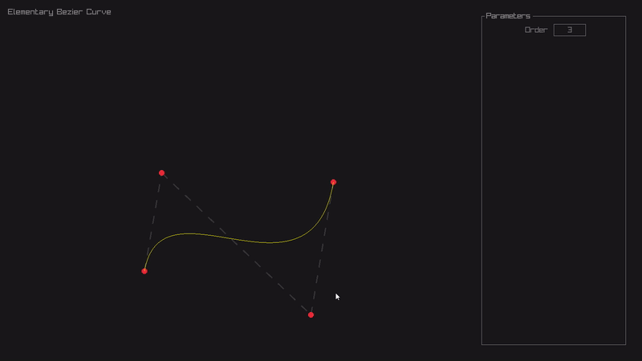

# Quick start

Don't forget to `git clone --recursive-submodules ...` or `git submodule update --init` to get raylib

Run `make` within the src/ folder to build everything.
Or use `cmake` for the same purpose.

No installation is introduced, so the main executable is located in the binary folder the project.

# Scenes

You can switch between scenes using `1`, `2`, `3`, `4` keys.

Use `space` to pause/unpause the scene

Use `R` to reset the scene without resetting its parameters

Use `Ctrl + R` to reset the scene and the parameters 

## 1. Rotating ellipses

</img>

## 2. Drawing polygons

</img>

</img>

## 3. Is point in the triangle?

</img>

## 4. Elementary Bezier curves

</img>